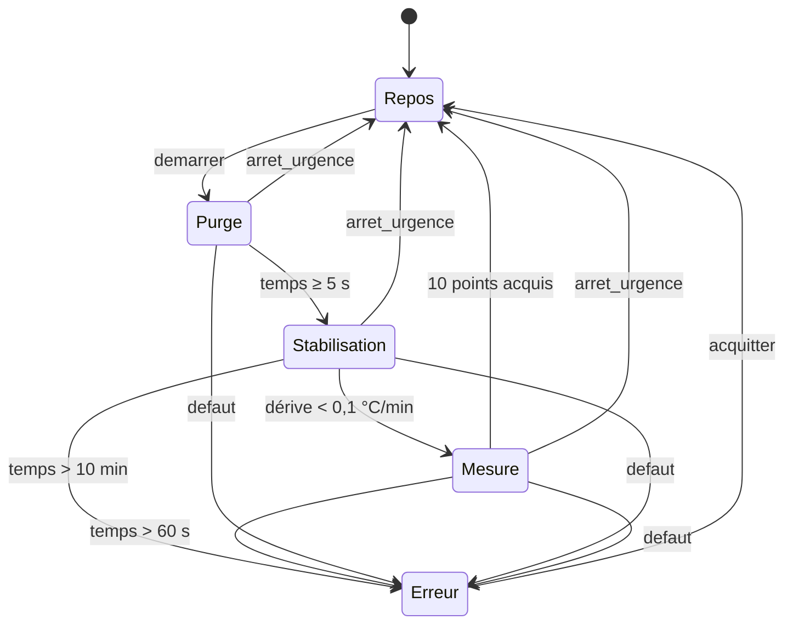

# Défi d6 · Machine à états d'acquisition

**Contexte.** Un banc de mesure suit un cycle : il attend un ordre de départ, purge l'enceinte pendant 5 s, attend que la température se stabilise, acquiert 10 points, puis revient au repos. Une erreur peut survenir à chaque étape.



Les transitions, dans l'ordre où elles se testent (la première condition vraie l'emporte) :

| État courant | Condition | État suivant |
|---|---|---|
| Repos | `demarrer` | Purge |
| Purge, Stabilisation, Mesure | `defaut` | Erreur |
| Purge, Stabilisation, Mesure | `arret_urgence` | Repos |
| Purge | `temps_ms >= 5000` | Stabilisation |
| Stabilisation | `derive_mk_min < 100` | Mesure |
| Stabilisation | `temps_ms > 600000` | Erreur |
| Mesure | `points >= 10` | Repos |
| Mesure | `temps_ms > 60000` | Erreur |
| Erreur | `acquitter` | Repos |
| tous | aucune condition vraie | le même état |

**Objectif.** Une machine à états lisible, sans allocation, dont les transitions sont testables sans matériel ni horloge.

## Le contrat

Dans `etats.hpp` :

- `enum class Etat { Repos, Purge, Stabilisation, Mesure, Erreur };` et la structure `Entrees` (fournies) ;
- `constexpr Etat suivant(Etat e, const Entrees& in) noexcept` : **fonction pure** qui applique ces transitions. Priorités : `defaut` d'abord (vers `Erreur`, depuis Purge, Stabilisation ou Mesure), puis `arret_urgence` (vers `Repos`), puis les autres conditions. Tout état hors de l'énumération (valeur corrompue) mène à `Erreur` ;
- au moins un `static_assert` qui vérifie une transition **à la compilation**.

Dans `etats.cpp` :

- `const char* nom(Etat e) noexcept` : `"Repos"`, `"Purge"`… et `"?"` pour une valeur hors énumération ;
- la classe `Automate` : `pas(entrees)` applique `suivant` et, à chaque changement d'état, ajoute au journal `"sortie X"` puis `"entrée Y"`. Le journal est un tableau de taille fixe (les 16 derniers messages) : aucune allocation.

## Critères de réussite

- la fonction de transition est pure (aucun effet de bord, aucun accès matériel) ;
- chaque `switch` couvre tous les états, sans `default:` fourre-tout (la vérification le contrôle, et `-Wswitch-enum` veille) ;
- un état inattendu mène à `Erreur`, jamais à un comportement indéfini ;
- le diagramme et le tableau de ce README restent cohérents avec le code (les tests les suivent).

```shell
./praxis check d6
```

## Pour aller plus loin

Remplace le `switch` de `suivant` par une table de transitions `constexpr` (un tableau de lignes « état, condition, état suivant ») et génère le diagramme Mermaid à partir de cette table.
